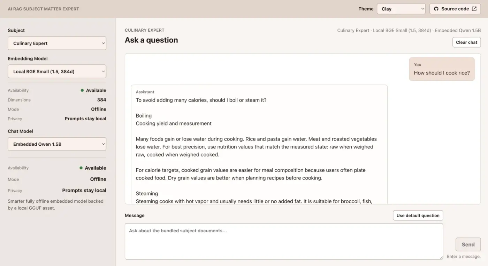

# AI RAG Subject Matter Expert

AI RAG Subject Matter Expert is a RAG application with a Kotlin Spring Boot
backend and a React, TypeScript, and Vite frontend. It lets a user choose a
subject, an embedding model, and a chat model, then asks questions against
static document knowledge bundled with the application. The application is
99% vibe coded with Codex.



## Quick Start With Docker Compose

Verified on macOS Tahoe 26.6.2 and Linux Fedora 44 x86_64.
Likely to work on Windows 11 as well.

This is the recommended way to run the demo. It requires Docker with Docker
Compose, for example [Docker Desktop](https://www.docker.com/products/docker-desktop/).
Allocate 10 GB of memory to Docker when using the full configuration.

```bash
git clone https://github.com/jojczykp/ai-rag-subject-matter-expert
cd ai-rag-subject-matter-expert
```

For the quickest startup, run the minimal configuration with one embedding and
one chat model and no Ollama:

```bash
docker compose up --build
```

To download several models and run Ollama in Docker, use the full configuration:

```bash
AISME_MODEL_PROFILE=full docker compose --profile ollama up --build
```

After startup finishes, open:

```text
http://localhost:8080
```

Stop the application while preserving database and downloaded model data:

```bash
docker compose down
```

Add `--volumes` to delete that data as well:

```bash
docker compose down --volumes
```

## Local Development

Use this path for hot reload, debugging, or direct access to Gradle and npm.

Dependencies:

- JDK 26
- Node.js 25.2.1 and npm 11.12.1
- [Docker Desktop](https://www.docker.com/products/docker-desktop/)

[Ollama](https://ollama.com/) is optional and only needed for configured Ollama
chat or embedding models. See [Ollama Model Is Unavailable](#ollama-model-is-unavailable)
for setup commands.

From the repository root, start PostgreSQL:

```bash
docker compose up -d db
```

Run the backend and frontend together:

```bash
SPRING_PROFILES_ACTIVE=minimal ./gradlew --parallel run
```

The root `run` task needs `--parallel` because both development servers are
long-running. After the backend reports `-----<[ R E A D Y ]>-----`, open:

```text
http://localhost:5173
```

To enable the full model catalog, prepare Ollama as described below and run
`./gradlew --parallel run` without the minimal profile.

Run only one application component when needed with `./gradlew :backend:run` or
`./gradlew :frontend:run`.

## First Run Notes

| Area                          | Default                                   |
|-------------------------------|-------------------------------------------|
| Subject                       | `culinary-expert`                         |
| Embedding model               | `local-bge-small`                         |
| Chat model                    | `embedded-qwen-1-5b`                      |
| Database                      | PostgreSQL + pgvector on `localhost:5432` |
| Backend (local dev)           | `http://localhost:8080`                   |
| Frontend (local dev)          | `http://localhost:5173`                   |
| Backend and Frontend (docker) | `http://localhost:8080`                   |

During startup, `/actuator/health` may temporarily report `OUT_OF_SERVICE`.
That usually means startup indexing or runtime initialization is still in
progress. When the application is ready, health should become `UP`.

Missing file-backed model assets are downloaded on startup when their
`download-missing-assets-on-startup` flag is enabled in
`backend/src/main/resources/application.yml`. Downloaded model assets are
ignored by git.

Local startup can take longer while model assets and the platform-matching
`llama-server` archive are downloaded. The Docker image already includes
`llama-server`, but still downloads enabled model weights. Both paths index
static subject documents into PostgreSQL before the application becomes ready.

To force fresh asset downloads on the next local startup:

```bash
./gradlew :backend:cleanDownloadedModelAssets
```

## What To Try

- Switch between `Passive House Architecture Expert` and `Culinary Expert`.
- With the full configuration, compare `Ollama Nomic Embed` and `Local BGE
  Small` retrieval behavior.
- With the full configuration, compare `Local Ollama Llama` with embedded
  `Qwen` or `Mistral` chat models.
- Inspect model availability, mode, privacy, and runtime details.
- Use the default subject question, then edit it and send your own.

The application keeps chat history in browser memory only. It does not persist
chat prompts, responses, or conversations.

## What This Shows

The codebase demonstrates:

- pragmatic Kotlin and Spring Boot backend development;
- PostgreSQL + pgvector persistence and vector retrieval;
- provider-neutral chat model routing;
- local Ollama integration;
- embedded local GGUF models through a managed `llama-server` process;
- OpenAI-compatible and Hugging Face TGI-style cloud adapter foundations;
- a usable React frontend with tests and coverage;
- Codex-assisted development using GPT-5.5, agents, skills, ADRs, and an
  implementation plan kept in sync with the code.

Main technologies:

- Kotlin 2.4.0
- Spring Boot 4.1.0
- Gradle 9.5.1 through the included Gradle Wrapper
- PostgreSQL + pgvector
- Flyway
- Spring Data JDBC and `JdbcClient`
- Kover backend coverage
- React, TypeScript, Vite, Vitest, React Testing Library, MSW, Playwright

## Architecture At A Glance

```text
React UI
  -> Spring Boot REST API
  -> configured static subjects
  -> bundled .txt documents
  -> deterministic chunks
  -> PostgreSQL + pgvector embeddings
  -> selected embedding model for retrieval
  -> selected chat model for answer generation
```

Supported model styles:

- embedded offline chat models via local `GGUF` files and managed
  `llama-server`;
- local server models through Ollama;
- OpenAI-compatible online providers;
- Hugging Face TGI-compatible online endpoints;
- local ONNX and Ollama embedding models.

See [Architecture](docs/ARCHITECTURE.md) and
[Model Runtime Integration](docs/ADR-003-model-runtime-integration.md) for the
full design.

## Build

Build and verify the backend and frontend:

```bash
./gradlew build
```

Build only the application image:

```bash
docker build -t aisme .
```

The multi-stage `Dockerfile` builds the React UI and Spring Boot application.
The final image contains the required runtime binaries but no build tools or
source code. Model weights are downloaded into the `model-data` volume instead
of being baked into the image.

## API Checks

```bash
curl -s http://localhost:8080/actuator/health | jq .
curl -s http://localhost:8080/actuator/info | jq .
curl -s http://localhost:8080/subjects | jq .
curl -s http://localhost:8080/embedding-models | jq .
curl -s http://localhost:8080/chat-models | jq .
```

Sample chat request:

```bash
curl -s http://localhost:8080/chat \
  -H 'Content-Type: application/json' \
  -d '{
    "subjectId": "culinary-expert",
    "modelId": "embedded-qwen-1-5b",
    "embeddingModelId": "local-bge-small",
    "message": "How should I cook rice?"
  }' | jq .
```

## Configuration

Most local behavior is configured in
`backend/src/main/resources/application.yml`.

The local database defaults to `jdbc:postgresql://localhost:5432/aisme`.
Override it with `AISME_DATASOURCE_URL`, `AISME_DATASOURCE_USERNAME`, and
`AISME_DATASOURCE_PASSWORD`. The Vite frontend calls
`http://localhost:8080` by default; set `VITE_BACKEND_API_BASE_URL` to use a
different backend URL.

Useful first changes:

- `aisme.subjects.default-subject-id`: choose the subject preselected by the UI.
- `aisme.embedding.default-model-id`: choose the default embedding model.
- `aisme.chat.default-model-id`: choose the default chat model.
- `aisme.subjects.definitions.<subject-id>.documents.chunk-size`: tune chunk
  size per subject.
- `aisme.subjects.definitions.<subject-id>.documents.chunk-overlap`: tune chunk
  overlap per subject.
- `aisme.chat.retrieved-chunk-limit`: tune how many chunks are sent to the
  selected chat model.
- `aisme.chat.models.<model-id>.enabled`: show or hide a chat model.
- `aisme.embedding.models.<model-id>.enabled`: enable or disable an embedding
  model for indexing and retrieval.
- `download-missing-assets-on-startup`: control startup downloads for local
  file-backed runtime and model assets.

See [Configuration Reference](docs/CONFIGURATION.md) for all properties and
examples.

## Development

Backend:

```bash
./gradlew :backend:check
./gradlew :backend:koverHtmlReport
```

Backend coverage report:

```text
backend/build/reports/kover/html/index.html
```

Frontend:

```bash
./gradlew :frontend:check
cd frontend
npm run test:coverage
```

Frontend coverage report:

```text
frontend/coverage/index.html
```

Full default verification:

```bash
./gradlew check
```

Optional backend integration tests:

```bash
./gradlew :backend:extendedIntegrationTest
```

Run individual optional suites when debugging a specific integration:

```bash
./gradlew :backend:ollamaTest
./gradlew :backend:openAiCompatibleTest
./gradlew :backend:huggingFaceTgiTest
./gradlew :backend:onnxModelTest
```

Playwright browser end-to-end tests are run explicitly:

```bash
cd frontend
npm run e2e
```

## Troubleshooting

### First Startup Is Slow

The backend may download local ONNX files, GGUF model files, and a
platform-specific `llama-server` archive, then index bundled subject documents.
Watch backend logs until startup completes.

In Docker, the platform-specific `llama-server` is already part of the image;
only model weights are downloaded. Watch progress with:

```bash
docker compose logs -f app
```

### Health Is OUT_OF_SERVICE

`OUT_OF_SERVICE` during startup usually means the application is still indexing
documents or initializing managed local runtimes. Retry `/actuator/health`
after startup logs report readiness.

### Docker Or PostgreSQL Fails

```bash
docker compose ps
docker compose logs --tail=100 db
docker compose down
docker compose up -d db
```

### Ollama Model Is Unavailable

```bash
ollama serve
ollama pull llama3.2
ollama pull nomic-embed-text:v1.5
ollama list
```

### Embedded Model Is Unavailable

Check backend logs. The model may still be downloading, the local GGUF file may
be missing, or managed `llama-server` may have failed to start.

In full mode, a connection reset followed by `did not become ready` usually
means Docker ran out of memory. Increase its memory allocation or use minimal
mode. Check current usage with:

```bash
docker stats
```

To force fresh local asset downloads:

```bash
./gradlew :backend:cleanDownloadedModelAssets
./gradlew :backend:run
```

### Frontend Cannot Call Backend

Make sure the backend is running on `http://localhost:8080`. If using another
port:

```bash
VITE_BACKEND_API_BASE_URL=http://localhost:8081 ./gradlew :frontend:run
```

## For Reviewers

- Fastest path: run [Quick Start](#quick-start-with-docker-compose), then use
  the UI.
- RAG design: [Architecture](docs/ARCHITECTURE.md).
- Technical decisions: [ADR index](docs/README.md#decision-records).
- Database schema: [Database Schema](docs/DATABASE_SCHEMA.md).
- Configuration details: [Configuration Reference](docs/CONFIGURATION.md).
- Delivery history and remaining work: [Implementation Plan](docs/IMPLEMENTATION_PLAN.md).

## Project Agents

Project-scoped Codex agents live in `.codex/agents/` and are described in
`AGENTS.md`.

- `orchestrator` coordinates end-to-end feature work across the other agents.
- `architect` proposes system design changes and implementation plans.
- `ux` proposes user flows, frontend interaction design, accessibility checks,
  and user-facing copy.
- `developer` implements production code and fixes production defects.
- `tester` creates tests, runs verification, and triages failures.
- `documenter` keeps Markdown documentation and project guidance in sync.

## Documentation

Start with [Documentation Index](docs/README.md).

Key documents:

- [Product Requirements Document](docs/PRD.md)
- [Architecture](docs/ARCHITECTURE.md)
- [Configuration Reference](docs/CONFIGURATION.md)
- [Implementation Plan](docs/IMPLEMENTATION_PLAN.md)
- [Database Schema](docs/DATABASE_SCHEMA.md)
