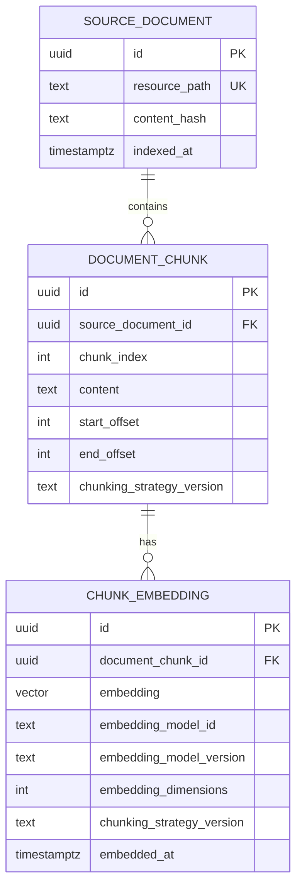

# Database Schema

## Purpose

This document describes the application database schema. Keep it aligned with
Flyway migrations under `backend/src/main/resources/db/migration`.

## Current Schema

The schema stores bundled source document metadata, deterministic chunks, and
one embedding per chunk per embedding model id.

Primary key values are generated by PostgreSQL with `gen_random_uuid()`.
`chunk_embedding` is unique by `(document_chunk_id, embedding_model_id)` so a
chunk can be indexed by more than one embedding model while stale metadata for
the same model is replaced.
